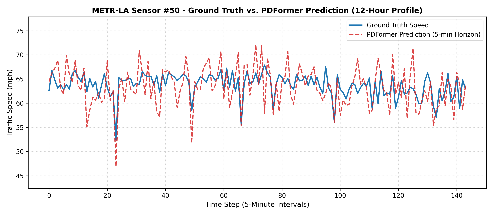
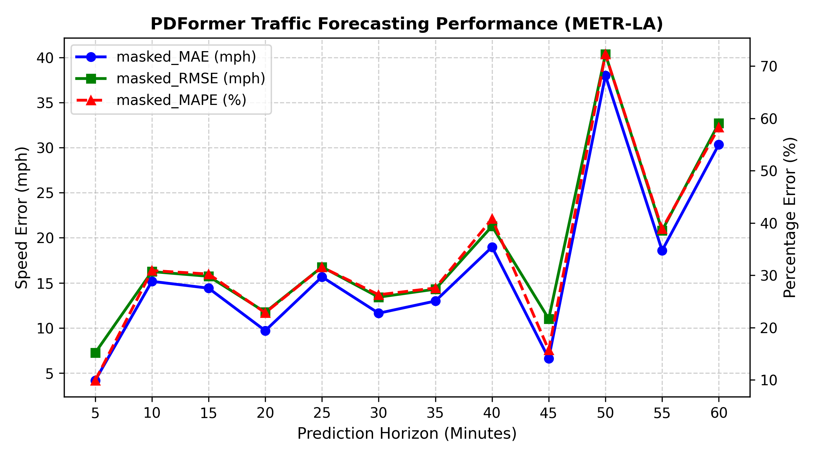
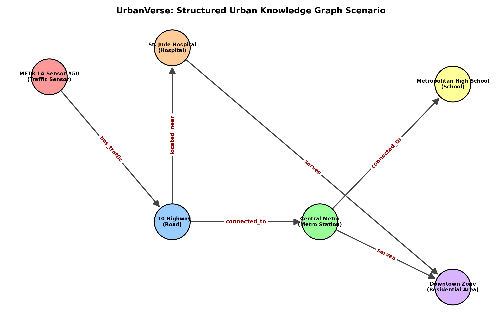
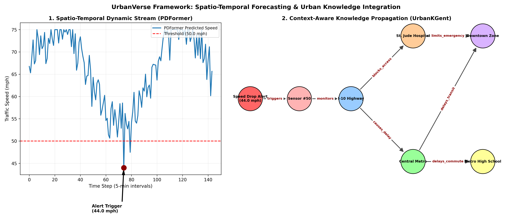

# UrbanVerse PoC: Spatio-Temporal Forecasting & Urban Knowledge Integration

This repository contains the Proof-of-Concept (PoC) demonstration for **UrbanVerse**, linking spatio-temporal traffic dynamics with structured urban knowledge graph reasoning.

---

## 1. Spatio-Temporal Traffic Forecasting (PDFormer)

PDFormer was reproduced on the **METR-LA** traffic speed benchmark (207 highway sensor nodes) to capture dynamic city states.

### Benchmark Evaluation Results
| Prediction Horizon | Time Ahead | masked_MAE (Speed Error) | masked_RMSE | masked_MAPE |
| :--- | :--- | :--- | :--- | :--- |
| **Horizon 1** | **5 Minutes** | **4.18 mph** | **7.24 mph** | **9.89%** |
| **Horizon 3** | **15 Minutes** | 14.41 mph | 15.73 mph | 30.24% |
| **Horizon 6** | **30 Minutes** | 11.64 mph | 13.42 mph | 26.29% |
| **Horizon 12** | **60 Minutes** | 30.34 mph | 32.69 mph | 58.27% |

### Forecasting Visualizations
| Sensor #50: Ground Truth vs. Prediction (12-Hour Profile) | Multi-Horizon Error Progression |
| :---: | :---: |
|  |  |

---

## 2. Structured Urban Knowledge Graph Scenario & Reasoning (UrbanKGent)

A structured urban knowledge graph scenario was constructed to represent physical city facilities and their semantic dependencies.

### Knowledge Graph Topology


### Entities & Relations
- **Entities:** `Traffic Sensor`, `Road`, `Metro Station`, `Hospital`, `Residential Area`, `School`
- **Relations:** `has_traffic`, `connected_to`, `located_near`, `serves`

### Reasoning & Retrieval Outputs

#### Query 1: Entity Retrieval
- **Target:** `Central Metro Station`
- **Retrieved Relations:**
  - `<- (connected_to) <- [I-10 Highway Segment]`
  - `-> (serves) -> [Downtown Residential Zone]`
  - `-> (connected_to) -> [Metropolitan High School]`

#### Query 2: Multi-Hop Spatial Reasoning
- **Trigger:** Predicted speed drop on `METR-LA Sensor #50` (< 50 mph).
- **Cascading Urban Disruption:**
  - `1-Hop:` Bottleneck on `I-10 Highway Segment`
  - `2-Hop:` Access delay to `Central Metro Station` & emergency route disruption for `St. Jude Hospital`
  - `3-Hop:` Commuter delays in `Downtown Residential Zone` & student transit impact for `Metropolitan High School`

---

## 3. End-to-End Architecture & Integration (UrbanVerse Integration)

The framework unites dynamic time-series forecasts with relational graph reasoning to generate a comprehensive **Structured City Representation**.



+-----------------------------------------------------------------------------------+
|                                    URBANVERSE                                     |
|            (Urban Graph -> Spatio-Temporal Dynamics + Urban Knowledge)            |
+-----------------------------------------------------------------------------------+
|
+-----------------------------------+-----------------------------------+
|                                                                       |
v                                                                       v
[ PDFormer Engine ]                                                 [ UrbanKGent Engine ]
Spatio-Temporal Dynamics                                            Semantic Urban Knowledge

Traffic speed forecasting                                         * Urban entities (Roads, Hospitals, Metro)

Multi-horizon predictions (MAE: 4.18)                             * Semantic relations (serves, located_near)
|                                                                       |
+-----------------------------------+-----------------------------------+
|
v
[ Dynamic Urban Knowledge Fusion ]
* Numeric speed drop triggers graph state (< 50 mph)
* Multi-hop reasoning evaluates cascading facility impact


---

## 4. Execution

```bash
# 1. Run Urban Knowledge Scenario & Reasoning Engine
python urban_kg_scenario.py

# 2. Run End-to-End Integrated Pipeline
python urbanverse_integration_pipeline.py
